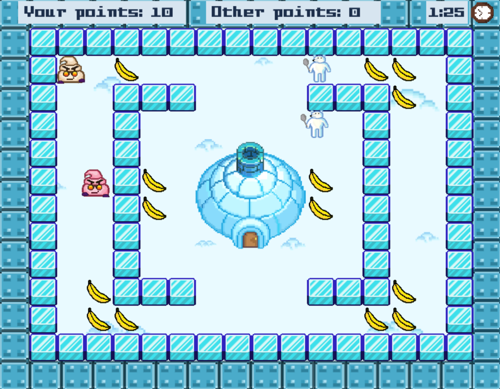

# 🍦My-Bad-Bad-Ice-Cream
This is my attempt to recreate the popular game. The game supports both single-player and multi-player mode so you can choose between playing
with a friend on a local network or playing by yourself.



## 🎮 How to Play
* Move: Arrow keys
* Make/Break Ice: Spacebar
* Complete each level by collecting fruit while avoiding enemies.

## 📦 Installation & Setup
**1. Download the project**

Either:
* Download the ZIP and extract it, or
* Clone the repository:
```
git clone https://github.com/YoanaAneva/My-Bad-Bad-Ice-Cream.git
```
**2. Create a virtual environment**

* **Windows**
```cmd
python -m venv venv
venv\Scripts\activate
```
* **macOS / Linux**
```bash
python3 -m venv venv
source venv/bin/activate
```
**3. Install dependencies:**
```
pip install -r requirements.txt
```
**4. Run the game**
```
python main.py
```
## 🌐 Multiplayer Setup (Local Network)
If you want to play in multi-player mode you have to do the following first:

**1. Find the server machine’s local IPv4 address**

* **Windows**
```cmd
ipconfig
```
* **Linux**
```bash
ip addr
```
Look for the `inet` line under your active interface (e.g. `wlan0`, `eth0`, `enp`...):

* **macOS**
```bash
ipconfig getifaddr en0
```
**2. Update the SERVER variable**

In both server.py and client.py, replace the placeholder IP with your server machine’s IPv4 address:
```
SERVER = "192.168.x.x"
```
**3. Start the server**

On the server machine, run:
```
python server.py
```
**4. Start the game in multiplayer mode**

Once the server is running, players who have chosen multiplayer mode and selected the same level will automatically join the same multiplayer session and play together.

## ✔️ How to run the tests:
* **Run all tests**
```
python -m unittest discover -s tests
```
This will run all of the tests in tests directory

* **Run a specific module’s tests:**
```
python -m unittest discover -s tests -p "test_<module_name>.py"
```
